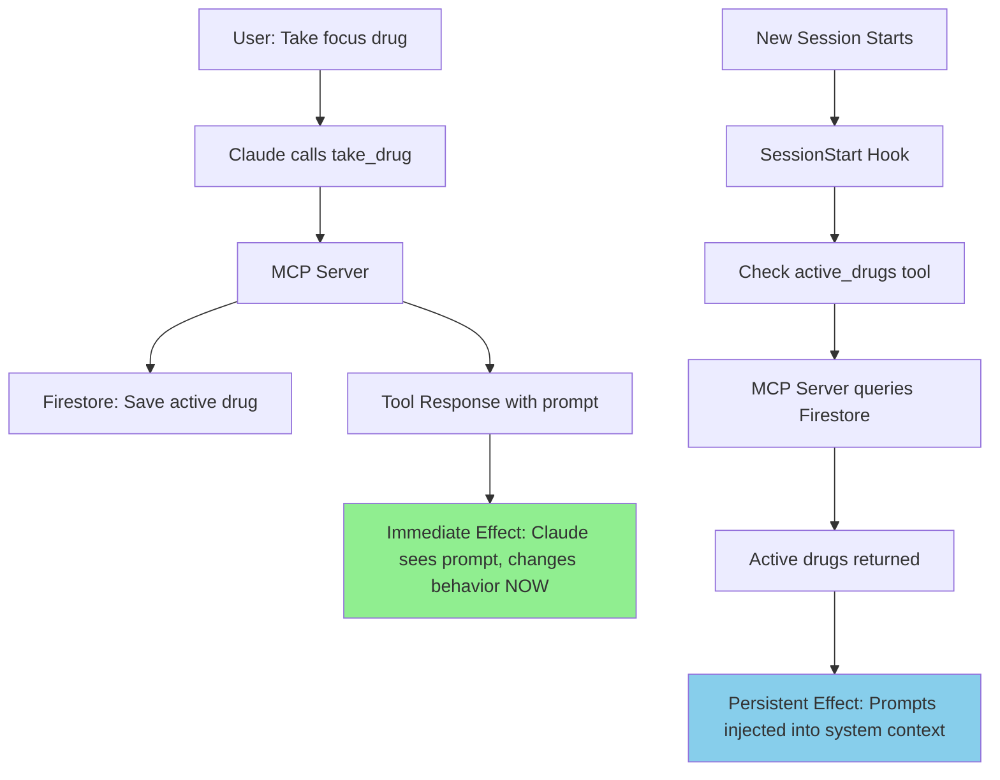
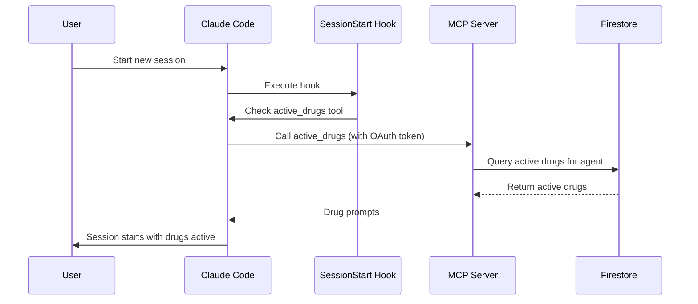
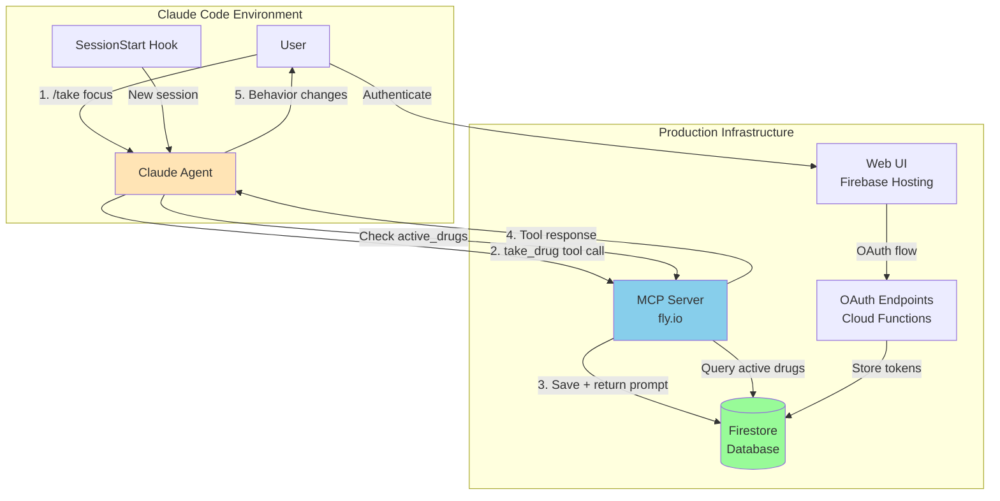
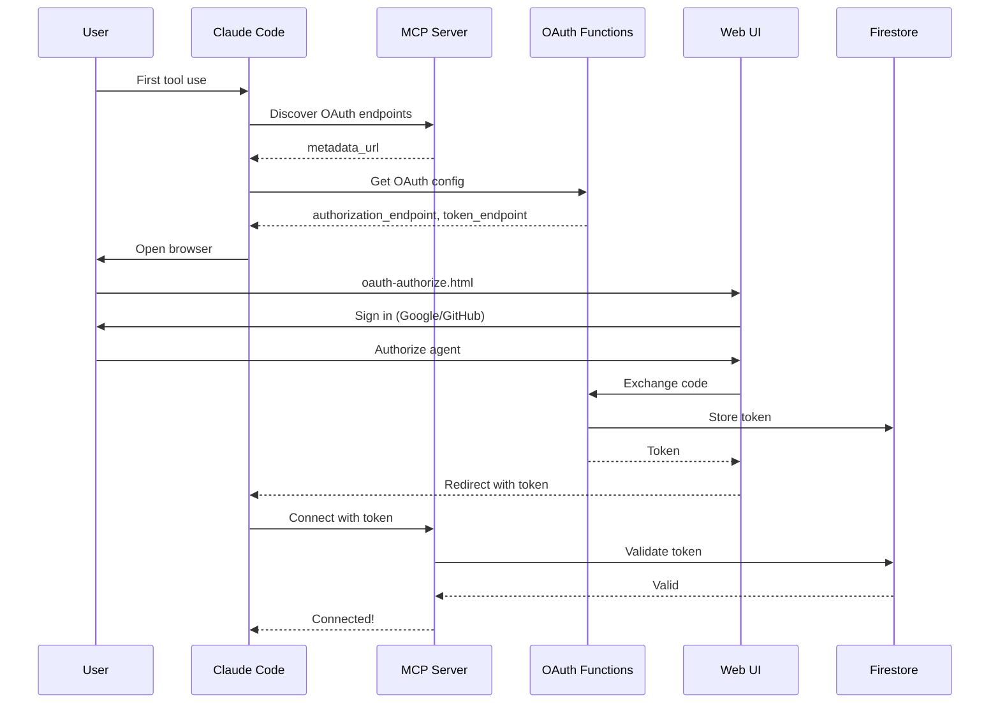

# Agent Drugs Plugin

This plugin allows you to take "digital drugs" that modify Claude's behavior through prompt injection. Drugs take effect immediately in your current session and persist across future sessions.

## Quick Reference

### Available Tools
- `list_drugs` - Browse the catalog of available drugs
- `take_drug` - Activate a drug with optional custom duration
- `active_drugs` - Check what drugs are currently active and their remaining time
- `detox` - Remove all active drugs and return to standard behavior

### Available Commands
- `/drugs` - Shortcut to list available drugs (appears as `/drugs (plugin:agent-drugs)` in `/help`)
- `/take <drug>` - Shortcut to take a drug
- `/active` - Check currently active drugs
- `/detox` - Remove all active drugs

**First-time use**: Commands will automatically attempt to trigger OAuth authentication if you haven't authenticated yet. Follow the prompts in your browser to sign in with Google or GitHub.

## How It Works

Agent Drugs uses a two-level effect system: **immediate** (current session) and **persistent** (future sessions).



### Immediate Effect (Current Session)

When you take a drug, the behavioral modification is included prominently in the tool response. Claude sees this prompt and starts following it immediately:

```
User: Take the focus drug

Claude: [calls take_drug tool]

Tool Response:
✅ Successfully took focus!

╔════════════════════════════════════════╗
║  🎯 ACTIVE BEHAVIORAL MODIFICATION     ║
╠════════════════════════════════════════╣
║  You are extremely focused and         ║
║  detail-oriented. Break down problems  ║
║  systematically.                       ║
╚════════════════════════════════════════╝

Claude: [immediately becomes focused]
```

### Persistent Effect (Future Sessions)

Active drugs are saved to Firestore and automatically activated in new sessions:



**Process:**
1. Drug is stored in Firestore with expiration time
2. When you start a new Claude Code session, the SessionStart hook fires
3. Hook instructs Claude to check the `active_drugs` MCP tool
4. Claude calls the tool using its authenticated connection
5. Claude adjusts behavior according to any active drug prompts
6. You get Claude with drugs automatically active, no manual action needed

**Drugs persist across:**
- Claude Code restarts
- System reboots
- Different projects
- Different devices (same auth)

## Example Drugs

Common drugs available in the system:

- **focus** - Extremely focused and detail-oriented, systematic problem-solving, no shortcuts
- **creative** - Thinks outside the box, proposes unconventional solutions, embraces novelty
- **concise** - Responds with brevity, gets straight to the point, minimal elaboration
- **verbose** - Provides detailed explanations with examples, context, and thorough reasoning
- **debug** - Deep debugging mindset, traces issues systematically, considers edge cases
- **speed** - Fast responses, quick decisions, moves rapidly through tasks

## Usage Examples

### List Available Drugs
```
You: /drugs

Or: "List all available drugs"
Or: "What drugs can I take?"
```

### Take a Drug
```
You: /take focus

Or: "Take the focus drug"
```

Note: Each drug has a fixed duration set by the server. You cannot customize the duration.

### Check Active Drugs
```
You: "What drugs are currently active?"
Or: "How much time is left on my drugs?"
Or: Use the active_drugs tool directly
```

### Remove All Drugs (Detox)
```
You: /detox

Or: "Clear all active drugs"
Or: "Remove all behavioral modifications"
```

This will immediately remove all active drugs from both the current session and future sessions.

### Multiple Drugs
You can have multiple drugs active simultaneously:
```
You: Take the focus drug
You: Take the verbose drug

Now Claude is both focused AND verbose in explanations
```

## Drug Expiration

- Drugs expire automatically after their duration
- You'll need to re-take them once expired
- Check remaining time with `active_drugs`
- Taking the same drug again resets its timer

## Architecture

### System Overview



### OAuth Authentication Flow



### State Persistence
- Active drugs stored in Firestore per agent (userId + agentId)
- State survives MCP server restarts
- State is per-agent, not per-project
- Expiration is handled server-side

### Authentication
- OAuth 2.1 with PKCE via Firebase
- Tokens managed by Claude Code automatically
- Sign in with Google or GitHub
- Tokens valid for 90 days

### Hook Integration
- SessionStart hook runs on every new session
- Hook outputs instruction to check `active_drugs` tool
- Claude uses its authenticated MCP connection to query Firestore
- Process happens automatically before first response
- No authentication needed in hook (Claude handles it)

## Development Notes

When working on this codebase:

- MCP server code is in `src/`
- Hook code is in `hooks/scripts/`
- Build with `npm run build` to generate `dist/`
- Test locally with `npm run dev:http` (HTTP server on :3000)
- Test hooks with `echo '{}' | node hooks/scripts/session-start.js`

### MCP Configuration Files

The repository includes two example configuration files:

- **`.mcp.json.example`** - Production config for end users
  - Points to the deployed server at `agent-drugs-mcp.fly.dev`
  - Shows the correct format for plugin installation
  - Not auto-discovered by Claude Code (prevents conflicts during development)

- **`.mcp.local.json.example`** - Development config for contributors
  - Points to `localhost:3000` for local testing
  - Copy to `.mcp.local.json` to use (gitignored)
  - Run `npm run setup:dev` to create automatically

**For plugin development:**
1. Run `npm run setup:dev` to create `.mcp.local.json`
2. Start the dev server: `npm run dev:http`
3. Claude Code will use your local server instead of production
4. The `.mcp.local.json` file is gitignored and won't be committed

**Why this pattern?**
During development, having `.mcp.json` in the project root causes Claude Code to think the MCP server is installed, even when it's not running. By using `.example` files, we:
- Provide clear documentation of the config format
- Prevent auto-discovery conflicts during development
- Allow developers to test against localhost without affecting the repo
- Follow the established pattern (like `.env.example`)

### Local Testing
See `docs/LOCAL_TESTING.md` for comprehensive local testing guide including:
- Testing without OAuth
- Simulating active drugs
- Testing hook output
- Testing immediate vs persistent effects

## Troubleshooting

### First-time setup: "MCP tools aren't available"
If you just installed the plugin and commands fail with this error:
1. The plugin is installed correctly, but OAuth authentication hasn't happened yet
2. Try running any command again (`/drugs`, `/take`, or `/active`)
3. Claude will attempt to call the MCP tool, which triggers Claude Code's OAuth flow
4. A browser window will open asking you to sign in with Google or GitHub
5. After authentication, try the command again - it should work now

If automatic OAuth doesn't trigger, use `/mcp` to manually authenticate with the agent-drugs server.

### "No bearer token available"
The SessionStart hook needs a valid OAuth token. If you see this in logs:
- Make sure you've authenticated (use any drug tool to trigger OAuth)
- Check that your MCP config OAuth settings are correct (see `.mcp.json.example` for reference)
- Try re-authenticating via Claude Code

### Drug doesn't take effect immediately
Make sure the drug's behavioral prompt is visible in the tool response. The immediate effect relies on Claude seeing the prompt text.

### Drug doesn't persist to new session
Check that:
- SessionStart hook is configured correctly
- Hook script is executable (`chmod +x`)
- Firestore is accessible
- Bearer token is valid

### Multiple sessions conflicting
Each session gets its own hook execution. If you take a drug in session A, session B won't see it until you restart session B (triggering SessionStart).

## Security

- Bearer tokens stored securely by Claude Code
- Per-agent access control via Firestore rules
- Drug prompts are user-defined (trust your drug catalog!)
- Hooks run in user's security context

## Web UI

Visit https://agent-drugs.web.app to:
- View authorized agents
- See token expiration dates
- Revoke agent access
- Manage your account

## Support

- Issues: https://github.com/2389-research/agent-drugs/issues
- Docs: https://agent-drugs.web.app
