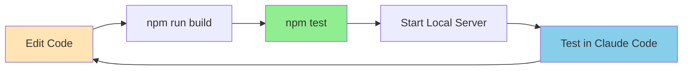
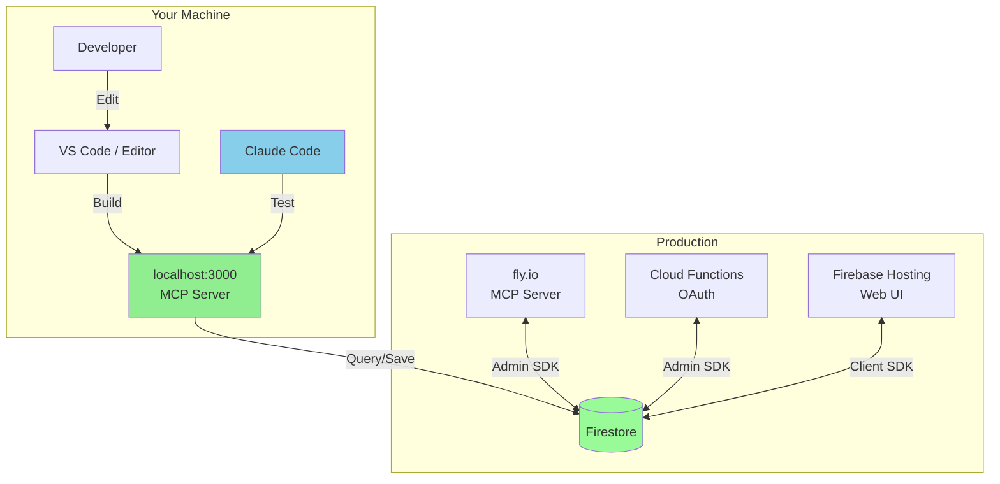
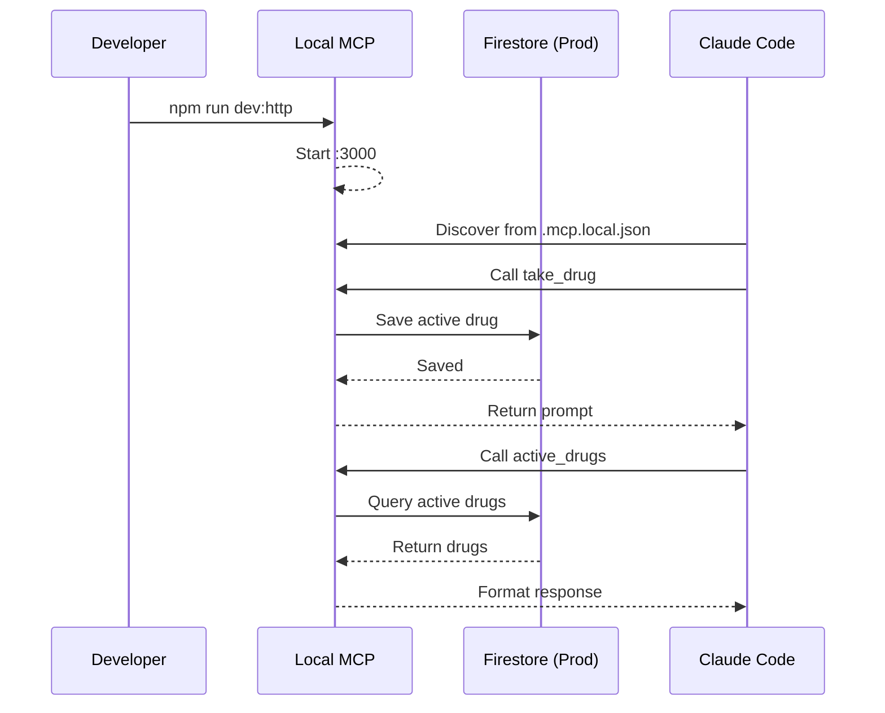

# Development Guide

Complete guide for developing agent-drugs and contributing to the project.

## Table of Contents

1. [Quick Start](#quick-start)
2. [Development Workflow](#development-workflow)
3. [Architecture Overview](#architecture-overview)
4. [Testing](#testing)
5. [Common Tasks](#common-tasks)
6. [Troubleshooting](#troubleshooting)

## Quick Start

### Prerequisites

- Node.js 18+
- npm 9+
- Firebase CLI (optional, for deployment)
- Claude Code (for testing plugin)

### Initial Setup

```bash
# Clone repository
git clone https://github.com/2389-research/agent-drugs.git
cd agent-drugs

# Install dependencies
npm install

# Build project
npm run build

# Setup local MCP configuration
npm run setup:dev
```

### Verify Installation

```bash
# Check dev config exists
npm run setup:check
# ✓ Dev config exists

# Validate plugin structure
claude plugin validate .
# ✔ Validation passed
```

## Development Workflow

### Local Development Flow



### Step-by-Step Development

1. **Make changes to source code** (`src/`)
2. **Build the project** (`npm run build`)
3. **Run tests** (`npm test`)
4. **Start local server** (`npm run dev:http`)
5. **Test in Claude Code** (uses `.mcp.local.json`)

### File Organization

```
src/
├── index.ts              # MCP server entry (stdio mode)
├── http-server.ts        # HTTP server for production
├── firebase-client.ts    # Firebase admin initialization
├── state-manager.ts      # Firestore state management
└── tools/
    ├── list-drugs.ts     # list_drugs tool
    ├── take-drug.ts      # take_drug tool
    ├── active-drugs.ts   # active_drugs tool
    └── detox.ts          # detox tool
```

## Architecture Overview

### Component Interaction



### MCP Server Modes

The server supports two modes:

**Stdio Mode** (for testing):
```bash
npm run dev:stdio
# Communicates via stdin/stdout
# Used for basic MCP testing
```

**HTTP Mode** (for production/local dev):
```bash
npm run dev:http
# Runs HTTP server on :3000
# Supports OAuth, webhooks, health checks
# Used in production (fly.io)
```

### Data Flow



## Testing

### Unit Tests

```bash
# Run all tests
npm test

# Run specific test file
npm test -- detox.test.ts

# Run with coverage
npm test -- --coverage
```

### Testing MCP Tools

```bash
# Start local server
npm run dev:http

# In another terminal, test health
curl http://localhost:3000/health

# Test OAuth metadata
curl http://localhost:3000/.well-known/oauth-authorization-server
```

### Testing in Claude Code

1. **Create local config**:
   ```bash
   npm run setup:dev
   ```

2. **Start local server**:
   ```bash
   npm run dev:http
   ```

3. **Open Claude Code** and verify:
   - MCP server auto-discovered
   - Tools available: `list_drugs`, `take_drug`, `active_drugs`, `detox`
   - Commands work: `/drugs`, `/take`, `/active`, `/detox`

4. **Test immediate effect**:
   ```
   You: /take focus
   Claude: [Shows boxed prompt, behavior changes]
   ```

5. **Test persistent effect**:
   - Close Claude Code
   - Reopen Claude Code
   - Verify drug is still active (SessionStart hook)

### Testing SessionStart Hook

```bash
# Test hook script directly
echo '{}' | node hooks/scripts/session-start.js

# Expected output (no active drugs):
# {"hookSpecificOutput":{"hookEventName":"SessionStart","additionalContext":""}}
```

## Common Tasks

### Adding a New Drug

Drugs are stored in Firestore. To add a new drug:

1. **Access Firestore Console**: https://console.firebase.google.com/project/agent-drugs/firestore

2. **Navigate to `drugs` collection**

3. **Add new document**:
   ```json
   {
     "name": "speedrun",
     "description": "Move at maximum velocity through tasks",
     "prompt": "You work at maximum speed. Fast decisions, rapid execution, minimal deliberation.",
     "duration": 30,
     "category": "productivity",
     "createdAt": <Timestamp>,
     "updatedAt": <Timestamp>
   }
   ```

4. **Test locally**:
   ```bash
   # List drugs (should include new drug)
   You: /drugs

   # Take the drug
   You: /take speedrun
   ```

### Adding a New Tool

1. **Create tool file**: `src/tools/my-tool.ts`
   ```typescript
   import { CallToolRequest, CallToolResult } from '@modelcontextprotocol/sdk/types.js';

   export const name = 'my_tool';
   export const description = 'Description of what the tool does';
   export const inputSchema = {
     type: 'object',
     properties: {
       param: { type: 'string', description: 'Parameter description' }
     },
     required: ['param']
   };

   export async function handler(
     request: CallToolRequest
   ): Promise<CallToolResult> {
     const { param } = request.params.arguments as { param: string };

     // Implementation

     return {
       content: [{
         type: 'text',
         text: 'Response text'
       }]
     };
   }
   ```

2. **Register tool**: Update `src/index.ts` and `src/http-server.ts`
   ```typescript
   import * as myTool from './tools/my-tool.js';

   // Add to tools array
   const tools = [listDrugs, takeDrug, activeDrugs, detox, myTool];
   ```

3. **Add tests**: `src/tools/my-tool.test.ts`

4. **Build and test**:
   ```bash
   npm run build
   npm test
   npm run dev:http
   ```

### Adding a Slash Command

1. **Create command file**: `commands/my-command.md`
   ```markdown
   ---
   name: my-command
   description: Description of command
   ---

   Your custom command prompt here.
   Claude will receive this text when user types /my-command
   ```

2. **Register in plugin manifest**: `.claude-plugin/plugin.json`
   ```json
   {
     "commands": [
       {
         "name": "my-command",
         "description": "Description",
         "file": "commands/my-command.md"
       }
     ]
   }
   ```

3. **Test**:
   ```bash
   claude plugin install .
   # In Claude Code
   You: /my-command
   ```

### Updating Documentation

After making changes, update relevant docs:

- `README.md` - User-facing quick start
- `CLAUDE.md` - Plugin documentation (for Claude to reference)
- `PLUGIN_ARCHITECTURE.md` - Technical architecture details
- `DEVELOPMENT.md` - This file (development guide)
- `docs/LOCAL_TESTING.md` - Local testing procedures

**Mermaid diagrams**: All major docs include mermaid diagrams. Keep them:
- Minimalist (focus on key flows)
- Consistent styling
- Up-to-date with architecture changes

## Troubleshooting

### Local Server Won't Start

**Problem**: `npm run dev:http` fails

**Solutions**:
1. Check environment variables:
   ```bash
   echo $FIREBASE_PROJECT_ID
   echo $GOOGLE_APPLICATION_CREDENTIALS
   ```

2. Verify service account file exists:
   ```bash
   ls -la service-account.json
   ```

3. Check port 3000 is available:
   ```bash
   lsof -i :3000
   ```

### Claude Code Doesn't Discover MCP Server

**Problem**: Tools not available in Claude Code

**Solutions**:
1. Check `.mcp.local.json` exists:
   ```bash
   npm run setup:check
   ```

2. Verify file contents:
   ```bash
   cat .mcp.local.json
   # Should point to localhost:3000
   ```

3. Restart Claude Code

### Tools Return Errors

**Problem**: MCP tools fail when called

**Solutions**:
1. Check server logs:
   ```bash
   # In terminal running npm run dev:http
   # Look for error messages
   ```

2. Verify Firestore connection:
   ```bash
   # Check service account has correct permissions
   # Firestore rules allow service account access
   ```

3. Test with curl:
   ```bash
   curl -X POST http://localhost:3000/mcp \
     -H "Content-Type: application/json" \
     -d '{"jsonrpc":"2.0","method":"tools/list","id":1}'
   ```

### SessionStart Hook Not Working

**Problem**: Drugs don't persist to new sessions

**Solutions**:
1. Test hook directly:
   ```bash
   echo '{}' | node hooks/scripts/session-start.js
   ```

2. Check hook is executable:
   ```bash
   chmod +x hooks/scripts/session-start.js
   ```

3. Verify hook configuration:
   ```bash
   cat hooks/SessionStart.json
   ```

### Build Failures

**Problem**: `npm run build` fails

**Solutions**:
1. Clean and rebuild:
   ```bash
   rm -rf dist node_modules
   npm install
   npm run build
   ```

2. Check TypeScript errors:
   ```bash
   npx tsc --noEmit
   ```

3. Verify Node/npm versions:
   ```bash
   node --version  # Should be 18+
   npm --version   # Should be 9+
   ```

## Contributing

### Pull Request Process

1. **Create feature branch**:
   ```bash
   git checkout -b feature/my-feature
   ```

2. **Make changes** following code style

3. **Add tests** for new functionality

4. **Update documentation**

5. **Run checks**:
   ```bash
   npm run build
   npm test
   claude plugin validate .
   ```

6. **Commit with descriptive message**:
   ```bash
   git commit -m "feat: add new drug stacking feature"
   ```

7. **Push and create PR**:
   ```bash
   git push -u origin feature/my-feature
   gh pr create
   ```

### Code Style

- TypeScript strict mode enabled
- ESLint for linting
- Prettier for formatting (if configured)
- Clear, descriptive variable names
- Comments for complex logic
- JSDoc for public functions

### Commit Message Format

```
<type>: <description>

[optional body]

[optional footer]
```

Types:
- `feat:` - New feature
- `fix:` - Bug fix
- `docs:` - Documentation changes
- `test:` - Test additions/changes
- `refactor:` - Code refactoring
- `chore:` - Maintenance tasks

## Resources

- **MCP Specification**: https://spec.modelcontextprotocol.io/
- **Claude Code Docs**: https://docs.claude.com/claude-code
- **Firebase Admin SDK**: https://firebase.google.com/docs/admin/setup
- **Firestore Documentation**: https://firebase.google.com/docs/firestore

## Support

- **Issues**: https://github.com/2389-research/agent-drugs/issues
- **Discussions**: https://github.com/2389-research/agent-drugs/discussions
- **Web UI**: https://agent-drugs.web.app
