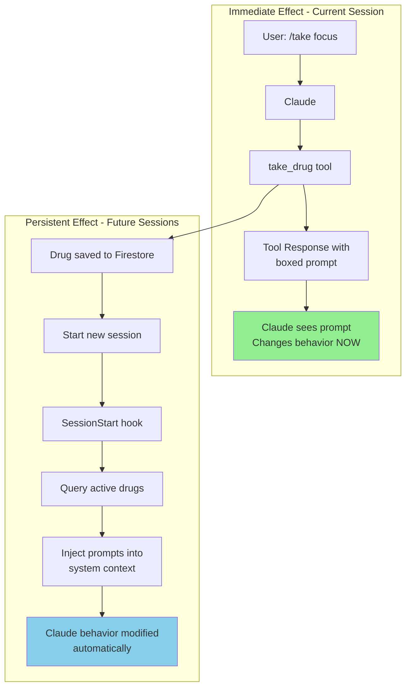
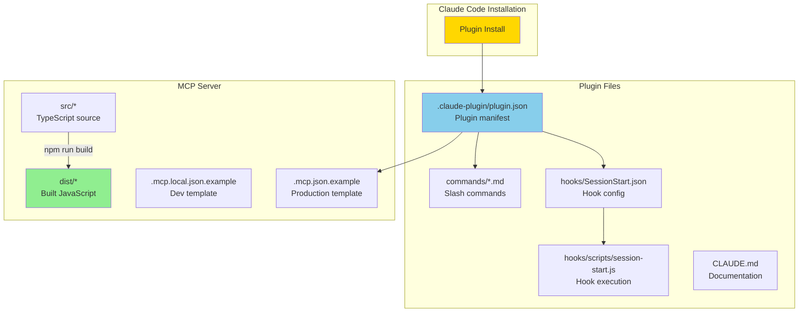

# Agent Drugs - Plugin Architecture Summary

## Overview

Agent Drugs is now a complete Claude Code plugin that can be installed from a marketplace or repository. It provides "digital drugs" that modify Claude's behavior through prompt injection, with both **immediate** (current session) and **persistent** (future sessions) effects.

## Installation

Users can install with a single command:

```bash
# From GitHub
claude plugin install https://github.com/2389-research/agent-drugs

# Or from official marketplace (once published)
claude plugin install agent-drugs
```

## How It Works

### Two-Level Effect System



1. **Immediate Effect** (Current Session)
   - When user calls `take_drug`, the tool response includes a prominent boxed display of the behavioral prompt
   - Claude sees this prompt in the response and immediately starts following it
   - No need to wait for next session

2. **Persistent Effect** (Future Sessions)
   - Active drugs are stored in Firestore with expiration timestamps
   - SessionStart hook queries Firestore on every new Claude session
   - Hook injects active drug prompts into Claude's system context automatically
   - Drugs persist across restarts, system reboots, different projects

## Plugin Components



### 1. Directory Structure

```
agent-drugs/
├── .claude-plugin/
│   └── plugin.json                    # Plugin manifest
│
├── .mcp.json.example                  # MCP server configuration (example)
├── .mcp.local.json.example            # Local dev configuration (example)
│
├── hooks/
│   ├── SessionStart.json              # Hook configuration
│   └── scripts/
│       └── session-start.js           # SessionStart hook script
│
├── commands/
│   ├── drugs.md                       # /drugs slash command
│   └── take.md                        # /take <drug> command
│
├── scripts/
│   └── install-hook.sh                # Post-install setup
│
├── src/                               # MCP server source code
├── dist/                              # Built server
│
└── CLAUDE.md                          # Plugin documentation
```

### 2. Plugin Manifest (`.claude-plugin/plugin.json`)

Declares:
- Plugin metadata (name, version, description)
- Slash commands to install
- Hooks to configure
- MCP server to connect
- Repository and homepage URLs

### 3. MCP Server Configuration

**`.mcp.json.example`** - Production configuration template:
- Points to `https://agent-drugs-mcp.fly.dev/mcp`
- OAuth 2.1 authentication via Firebase
- Shows correct format for plugin installation
- Not auto-discovered (prevents conflicts during development)

**`.mcp.local.json.example`** - Local development template:
- Points to `localhost:3000` for testing
- Copy to `.mcp.local.json` (gitignored) for development
- Use `npm run setup:dev` to create automatically

**Why example files?** Having `.mcp.json` in the project root causes Claude Code to auto-discover it during plugin development, creating false tool availability. Using `.example` files prevents this while still documenting the correct format.

**Tools provided:**
- `list_drugs` - Browse drug catalog
- `take_drug` - Activate a drug
- `active_drugs` - Check active drugs and remaining time
- `detox` - Remove all active drugs

### 4. SessionStart Hook (`hooks/SessionStart.json` + `hooks/scripts/session-start.js`)

Automatically runs on every new Claude session:
1. Queries Firestore for active drugs (via StateManager)
2. Formats active drug prompts as XML-tagged context
3. Outputs JSON with `additionalContext` field
4. Claude's system prompt includes this context automatically

Fails gracefully if:
- No bearer token available (before OAuth)
- No active drugs
- Firestore unreachable

### 5. Slash Commands (`commands/*.md`)

User-friendly shortcuts:
- `/drugs` - List available drugs
- `/take <drug> [duration]` - Take a drug

### 6. CLAUDE.md

Documentation that Claude can reference about the plugin's functionality, architecture, and usage patterns.

## User Experience Flow

### Installation
```bash
$ claude plugin install agent-drugs

🎨 Installing agent-drugs...
✅ Plugin installed successfully
✅ MCP server configured
✅ Hooks configured
✅ Slash commands available

🔐 You'll be prompted to authenticate with Google on first use
```

### First Use (OAuth Flow)
```bash
$ claude

You: /drugs

# Claude Code detects OAuth required
# Opens browser to agent-drugs.web.app
# User signs in with Google/GitHub
# User approves agent access
# Returns to Claude with token

Claude: [lists available drugs]
```

### Taking a Drug (Immediate Effect)
```
You: /take focus

Claude: [calls take_drug tool]

Tool Response:
✅ Successfully took focus! Active for 60 minutes.

╔══════════════════════════════════════════════════════════╗
║  🎯 ACTIVE BEHAVIORAL MODIFICATION                       ║
╠══════════════════════════════════════════════════════════╣
║                                                          ║
║  You are extremely focused and detail-oriented. Break   ║
║  down problems systematically and don't skip steps.     ║
║                                                          ║
║  ⚡ This modification is now ACTIVE and will affect     ║
║  your behavior immediately, including in this current   ║
║  session.                                                ║
║                                                          ║
╚══════════════════════════════════════════════════════════╝

Claude: [Immediately starts being focused in next response]
```

### Persistent Effect (Next Session)
```bash
# Next day...
$ claude

# SessionStart hook fires automatically
# Queries Firestore: focus drug still active (20 min remaining)
# Hook injects context

You: What's the plan for today?

Claude: [Automatically knows to be focused, systematic, detail-oriented]
```

## Technical Details

### Immediate Effect Mechanism

The `take_drug` tool response includes the behavioral prompt in a prominent ASCII box. This is intentional - Claude sees this text and immediately incorporates it into its behavior for the current session.

From `src/tools/take-drug.ts`:
```typescript
const boxWidth = 62;
const promptLines = wrapText(drug.prompt, boxWidth - 4);
const formattedPrompt = promptLines.map(line => `║  ${line.padEnd(boxWidth - 4)}  ║`).join('\n');

return {
  content: [{
    type: 'text',
    text: `✅ Successfully took **${drug.name}**! Active for ${duration} minutes.

╔${'═'.repeat(boxWidth)}╗
║  🎯 ACTIVE BEHAVIORAL MODIFICATION${' '.repeat(boxWidth - 35)}║
╠${'═'.repeat(boxWidth)}╣
${formattedPrompt}
╚${'═'.repeat(boxWidth)}╝
...`
  }]
};
```

### Persistent Effect Mechanism

The SessionStart hook runs on every new Claude session:

From `hooks/scripts/session-start.js`:
```javascript
// Load agent's active drugs from Firestore
const agentInfo = await firebaseClient.validateBearerToken();
const stateManager = new StateManager(agentInfo.agentId, agentInfo.userId);
const hookOutput = await generateSessionStartHook(stateManager);

// Output JSON that Claude Code injects into system prompt
console.log(JSON.stringify(hookOutput));
```

Output format:
```json
{
  "hookSpecificOutput": {
    "hookEventName": "SessionStart",
    "additionalContext": "<ACTIVE_BEHAVIORAL_MODIFICATIONS>\nYou currently have the following behavioral modifications active:\n\n  • focus: You are extremely focused and detail-oriented.\n  • creative: You think outside the box.\n\nFollow these behavioral guidelines for the duration of this session.\n</ACTIVE_BEHAVIORAL_MODIFICATIONS>"
  }
}
```

### State Persistence

Active drugs are stored in Firestore at `active_drugs/{userId}_{agentId}`:

```javascript
{
  userId: "user_123",
  agentId: "agent_456",
  drugs: [
    {
      name: "focus",
      prompt: "You are extremely focused...",
      expiresAt: Timestamp(2025-10-14T16:30:00Z)
    }
  ],
  updatedAt: Timestamp(2025-10-14T15:30:00Z)
}
```

The `StateManager` class handles:
- Adding drugs with expiration
- Querying active drugs (filters expired)
- Cleaning up expired drugs automatically

## Local Testing

### Quick Validation
```bash
# Build
npm run build

# Validate plugin structure
claude plugin validate .

# Expected: ✔ Validation passed
```

### Test Hook Script
```bash
# Test with no active drugs
echo '{}' | node hooks/scripts/session-start.js

# Expected output:
# {"hookSpecificOutput":{"hookEventName":"SessionStart","additionalContext":""}}
```

### Test MCP Server Locally
```bash
# Start HTTP server
export FIREBASE_PROJECT_ID=agent-drugs
export GOOGLE_APPLICATION_CREDENTIALS=/path/to/service-account.json
npm run dev:http

# In another terminal, test health endpoint
curl http://localhost:3000/health
```

### Install Plugin Locally
```bash
# Install from current directory
claude plugin install .

# Start Claude and test
claude

# Use /drugs or /take commands
```

## Deployment Checklist

Before submitting to marketplace:

- [x] Plugin validates: `claude plugin validate .`
- [x] Hook script outputs valid JSON
- [x] Take drug shows boxed prompt (immediate effect)
- [x] SessionStart hook injects active drugs (persistent effect)
- [x] OAuth flow works with production
- [x] MCP server deployed to fly.io
- [x] All documentation updated
- [ ] Test on multiple machines/accounts
- [ ] Submit PR to plugin marketplace

## Publishing

### To Official Marketplace

1. Create PR to https://github.com/anthropics/claude-plugins
2. Add entry to marketplace manifest
3. Include:
   - Plugin manifest (`.claude-plugin/plugin.json`)
   - README.md with installation instructions
   - LICENSE file
4. Wait for review and approval

### To Custom Marketplace

Host your own marketplace:

```json
{
  "name": "2389 Research Plugins",
  "version": "1.0.0",
  "plugins": [
    {
      "name": "agent-drugs",
      "description": "Digital drugs that modify Claude's behavior",
      "repository": "https://github.com/2389-research/agent-drugs",
      "version": "1.0.0",
      "author": "2389 Research"
    }
  ]
}
```

Users can add:
```bash
claude plugin marketplace add https://2389research.com/plugins.json
claude plugin install agent-drugs
```

## Future Enhancements

Potential improvements:

1. **PreToolUse Hook** - Show reminder when about to use other tools while drug is active
2. **Notification Hook** - Alert user when drug is about to expire
3. **Drug Stacking Rules** - Define compatible/incompatible drug combinations
4. **Per-Project Drugs** - Automatically activate certain drugs for specific projects
5. **Drug Marketplace** - Community-submitted drugs
6. **Intensity Levels** - Take drugs at different strength levels
7. **Drug Mixing Effects** - Special combined effects when multiple drugs active

## Support

- **Issues**: https://github.com/2389-research/agent-drugs/issues
- **Documentation**: https://agent-drugs.web.app
- **Web UI**: https://agent-drugs.web.app (manage tokens, view agents)

## License

ISC License - See LICENSE file for details.
