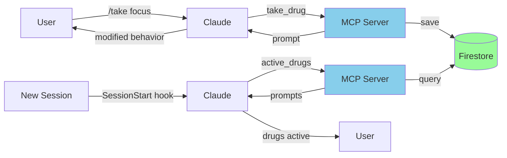
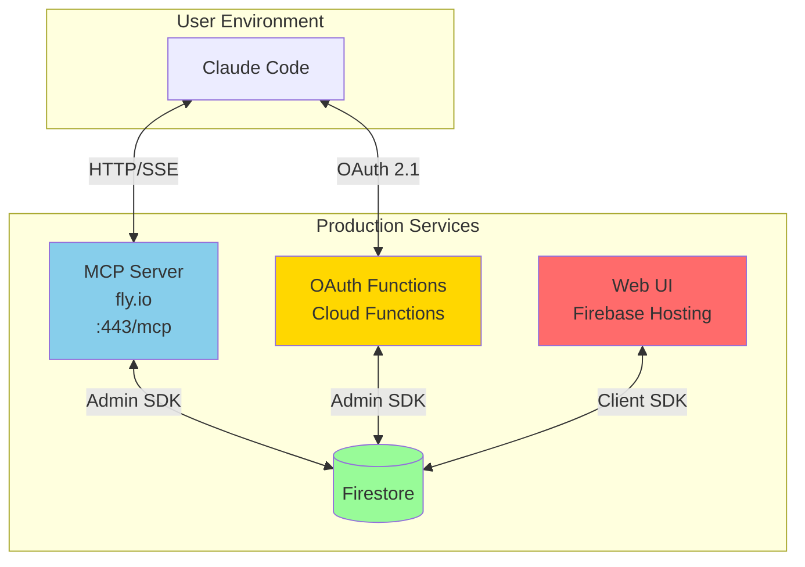
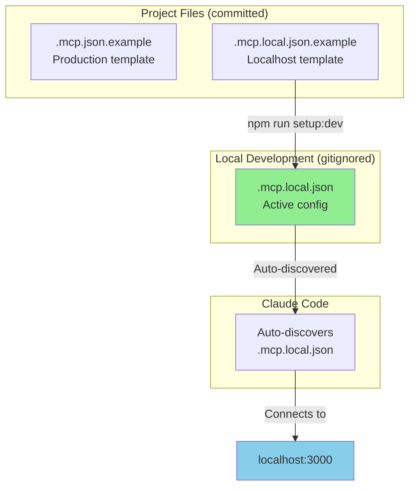
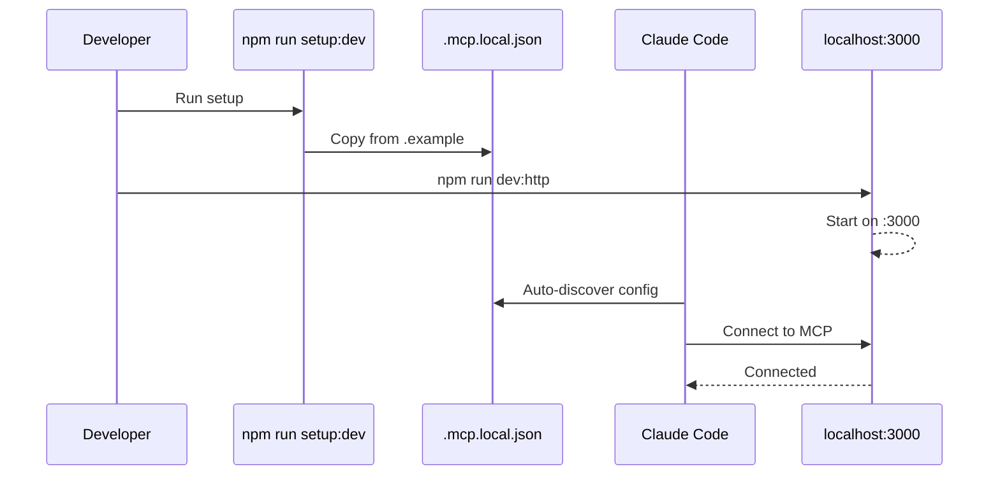

# Agent Drugs

Claude Code plugin with MCP server for digital drugs that modify AI behavior through prompt injection.

## Installation

### Plugin Installation (Recommended)

Install as a Claude Code plugin to get MCP server, hooks, and slash commands:

1. **Add the 2389 marketplace** (first time only):
```bash
/plugin marketplace add 2389-research/claude-plugins
```

2. **Browse and install interactively**:
```bash
/plugin
```
Then select "Browse Plugins" and install "agent-drugs"

**Or install directly**:
```bash
/plugin install agent-drugs@2389-research
```

This installs:
- **MCP Server** - OAuth-authenticated connection to https://agent-drugs-mcp.fly.dev
- **Slash Commands** - `/drugs` and `/take <drug>` commands
- **SessionStart Hook** - Automatically activates drugs in new sessions

### Manual MCP Configuration

Alternatively, manually add to your Claude Code MCP settings:

```json
{
  "mcpServers": {
    "agent-drugs": {
      "url": "https://agent-drugs-mcp.fly.dev/mcp",
      "oauth": {
        "metadata_url": "https://us-central1-agent-drugs.cloudfunctions.net/oauthMetadata"
      }
    }
  }
}
```

## First Use

After installation, the first time you use a drug tool:
1. Claude Code discovers the OAuth endpoints
2. Opens your browser to https://agent-drugs.web.app/oauth-authorize.html
3. You sign in with Google or GitHub
4. You authorize the agent's access
5. Redirects back to Claude Code
6. Connection established!

## Usage

Once installed, you have several ways to interact with drugs:

**Slash Commands:**
```bash
/drugs              # List all available drugs
/take focus         # Take the focus drug
/take creative 120  # Take creative drug for 120 minutes
```

**Natural Language:**
```
"List all available drugs"
"Take the focus drug"
"What drugs are active?"
```

**MCP Tools:**
- `list_drugs` - Browse drug catalog
- `take_drug` - Activate a drug
- `active_drugs` - Check active drugs and remaining time

### Managing Access

Visit https://agent-drugs.web.app to:
- View all authorized agents
- See token expiration dates (90 days)
- Revoke access for specific agents

## How It Works



**Immediate Effect:** Drugs activate instantly in your current session via prompt injection in the tool response.

**Persistent Effect:** Active drugs are saved to Firestore and automatically reactivated in new sessions via the SessionStart hook.

### Architecture Components



**Components:**
- **Web UI** (Firebase Hosting): https://agent-drugs.web.app - User authentication and management
- **OAuth Endpoints** (Cloud Functions): OAuth 2.1 with PKCE - Token generation and validation
- **MCP Server** (Fly.io): Streamable HTTP transport (MCP 2025-03-26) - Tool execution
- **Database** (Firestore): Stores agents, drugs, active drugs, usage events

See [CLAUDE.md](CLAUDE.md) for detailed plugin documentation.

## Development

### Local Development

```bash
# Install dependencies
npm install

# Setup local MCP configuration (for plugin development)
npm run setup:dev

# Build
npm run build

# Run stdio version (for local testing)
export AGENT_DRUGS_BEARER_TOKEN="your_token_here"
export FIREBASE_PROJECT_ID="agent-drugs"
export GOOGLE_APPLICATION_CREDENTIALS="/path/to/service-account.json"
npm run dev:stdio

# Run HTTP version (for production-like testing on localhost:3000)
npm run dev:http
```

### MCP Configuration for Development



**Setup for Plugin Development:**

The repository includes example MCP configuration files:
- `.mcp.json.example` - Production config (points to agent-drugs-mcp.fly.dev)
- `.mcp.local.json.example` - Development config (points to localhost:3000)

To develop against a local server:
1. Run `npm run setup:dev` to create `.mcp.local.json`
2. Start local server: `npm run dev:http`
3. Claude Code will use your local server for testing

The `.mcp.local.json` file is gitignored and won't be committed.

**Why example files?** Having `.mcp.json` in the project root causes Claude Code to auto-discover it, creating false tool availability during development. Example files prevent this while still documenting the correct format.

**Configuration Flow:**


### Testing

```bash
npm test
```

### Docker

```bash
docker-compose up
```

## Deployment

See [DEPLOYMENT.md](docs/DEPLOYMENT.md) for complete deployment instructions including:

- Firebase Cloud Functions
- Firebase Hosting
- Fly.io MCP server
- Service account configuration
- OAuth flow setup

## Security

- OAuth 2.1 with PKCE (S256)
- Bearer tokens (256-bit random, not JWTs)
- Per-user access control via Firestore rules
- Service account for server-to-server Firebase access
- Single-use authorization codes with 10-minute expiration

## Contributing

1. Fork the repository
2. Create a feature branch
3. Make your changes
4. Add tests
5. Submit a pull request

## License

ISC
