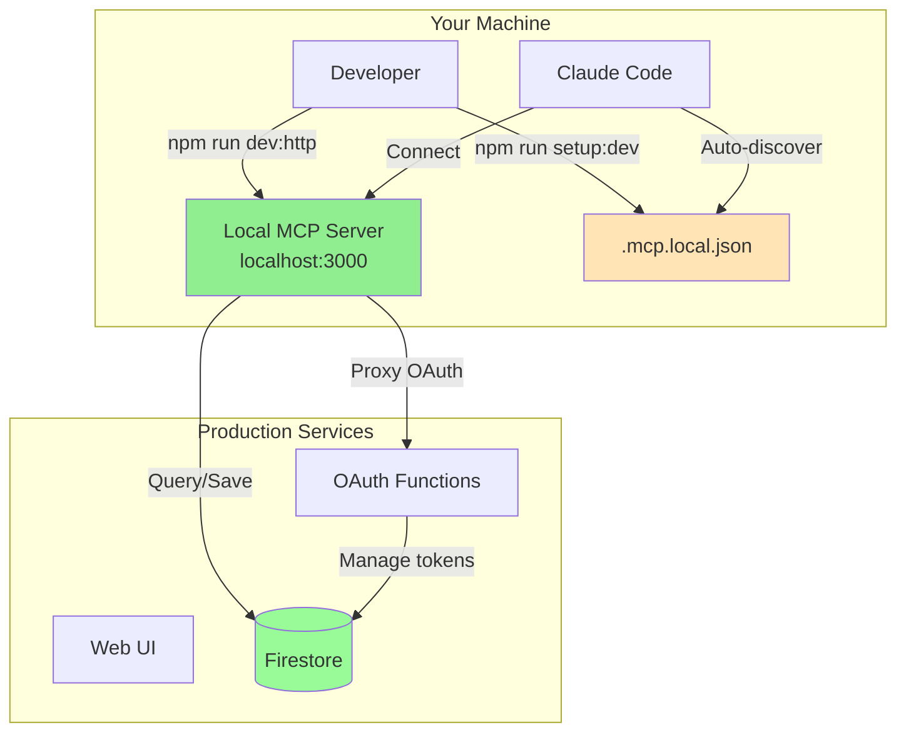
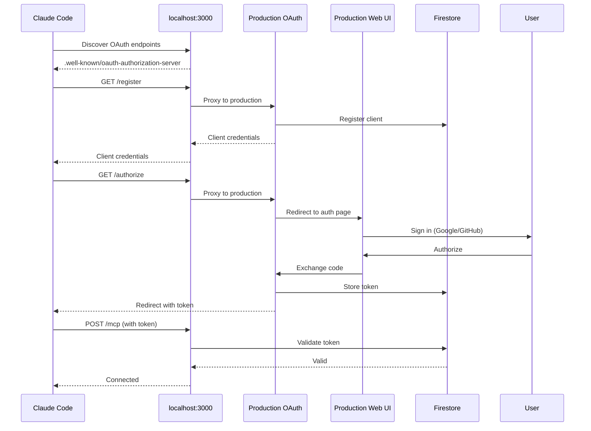
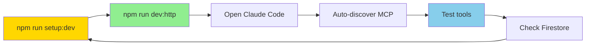

# Local Testing Guide

## Prerequisites

1. **Download Firebase Service Account Credentials**
   ```bash
   # Go to: https://console.firebase.google.com/project/agent-drugs/settings/serviceaccounts
   # Click "Generate New Private Key"
   # Save as: service-account.json in project root
   ```

2. **Build the MCP server**
   ```bash
   npm run build
   ```

## Option 1: Test with Docker (Recommended)

### Start the MCP server

```bash
docker-compose -f docker-compose.dev.yml up --build
```

The MCP server will be available at `http://localhost:3000`

### Test the OAuth flow

Run the interactive test script:

```bash
./test-oauth-flow.sh
```

This will:
1. Discover OAuth endpoints from production
2. Generate PKCE challenge
3. Open authorization URL in your browser
4. Exchange code for access token
5. Test MCP server connection

### Manual testing

1. **Health check**:
   ```bash
   curl http://localhost:3000/health
   ```

2. **Get authorization URL** (use output from test script)

3. **Test MCP connection with token**:
   ```bash
   curl -H "Authorization: Bearer agdrug_xxx..." \
     http://localhost:3000/mcp
   ```

## Option 2: Run Directly (No Docker)

```bash
# Set environment variables
export FIREBASE_PROJECT_ID=agent-drugs
export GOOGLE_APPLICATION_CREDENTIALS=/path/to/service-account.json

# Run HTTP server
npm start
```

## Testing with Claude Code

### Method 1: Use .mcp.local.json (Recommended)

Create a local MCP configuration from the example:

```bash
# Copy the example to create your local config
npm run setup:dev

# Or manually:
cp .mcp.local.json.example .mcp.local.json
```

This creates `.mcp.local.json` in your project root, which Claude Code will auto-discover. The file points to `localhost:3000` without OAuth (for simpler local testing).

**Note:** The `.mcp.local.json` file is gitignored and won't be committed. The repository includes `.mcp.local.json.example` as a template for developers.

### Method 2: Add to Claude Code config

Add this to your Claude Code MCP config (`~/.config/claude-code/config.json`):

#### With Local OAuth (recommended):
```json
{
  "mcpServers": {
    "agent-drugs-local": {
      "type": "http",
      "url": "http://localhost:3000/mcp",
      "oauth": {
        "metadata_url": "http://localhost:3000/.well-known/oauth-authorization-server"
      }
    }
  }
}
```

#### With Production OAuth (alternative):
```json
{
  "mcpServers": {
    "agent-drugs-local": {
      "type": "http",
      "url": "http://localhost:3000/mcp",
      "oauth": {
        "metadata_url": "https://us-central1-agent-drugs.cloudfunctions.net/oauthMetadata"
      }
    }
  }
}
```

### With Manual Token:
```json
{
  "mcpServers": {
    "agent-drugs-local": {
      "url": "http://localhost:3000/mcp",
      "headers": {
        "Authorization": "Bearer agdrug_xxx..."
      }
    }
  }
}
```

Get a token by running `./test-oauth-flow.sh` or visiting https://agent-drugs.web.app/oauth-authorize.html

## What Gets Tested

### Local OAuth Endpoints (Proxy to Production)
- ✅ OAuth metadata discovery (local endpoint returns local URLs)
- ✅ Client registration (proxied to production Cloud Function)
- ✅ Authorization (proxied to production Cloud Function → Firebase Hosting)
- ✅ User authentication (Google/GitHub via production)
- ✅ Token exchange with PKCE (proxied to production Cloud Function)
- ✅ Callback handling (proxied to production)

### MCP Server (Local)
- ✅ Streamable HTTP connection (MCP 2025-03-26)
- ✅ Bearer token validation against Firestore
- ✅ Tool listing
- ✅ Drug operations (list, take, active)
- ✅ State management (Firestore persistence)

## Architecture During Local Testing

### Setup Overview



### OAuth Flow with Local Server



### Development Testing Flow



**Key Points:**
- Local metadata endpoint returns `localhost:3000` URLs
- OAuth operations are proxied to production Cloud Functions
- MCP client sees only local endpoints during discovery
- Authentication and data storage happen in production
- Only the MCP protocol handler runs locally

## Troubleshooting

### "Invalid bearer token" error

1. Check token hasn't expired (90 days):
   ```bash
   firebase firestore:get agents/{agentId}
   ```

2. Verify service account has Firestore read/write permissions

3. Check MCP server logs:
   ```bash
   docker-compose -f docker-compose.dev.yml logs -f
   ```

### OAuth flow fails

1. Verify production endpoints are live:
   ```bash
   curl https://us-central1-agent-drugs.cloudfunctions.net/oauthMetadata
   ```

2. Check browser console for errors on oauth-authorize.html

3. Verify PKCE code_verifier matches code_challenge

### MCP server won't start

1. Check service-account.json exists and has correct permissions

2. Verify Firebase project ID is correct:
   ```bash
   firebase projects:list
   ```

3. Check Docker logs:
   ```bash
   docker-compose -f docker-compose.dev.yml logs
   ```

### State not persisting

1. Verify active_drugs collection exists in Firestore

2. Check Firestore rules allow service account writes:
   ```bash
   firebase firestore:rules:release
   ```

3. Look for Firestore errors in MCP server logs

## Next Steps

Once local testing works:

1. **Deploy to fly.io**: See [DEPLOYMENT.md](DEPLOYMENT.md)
2. **Update OAuth URLs**: Point to fly.io URL instead of localhost
3. **Test production**: Full OAuth flow with production MCP server
4. **Monitor**: Check fly.io logs and Firebase Console

## Tips

- Use `./test-oauth-flow.sh` for quick OAuth testing
- Keep Docker running during development
- Check `docker-compose logs -f` for real-time debugging
- Use Firebase Emulator for faster iteration (optional)
- Test token expiration by manually setting createdAt in Firestore
